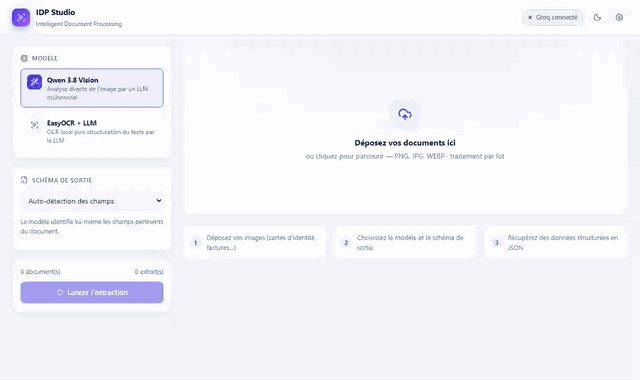
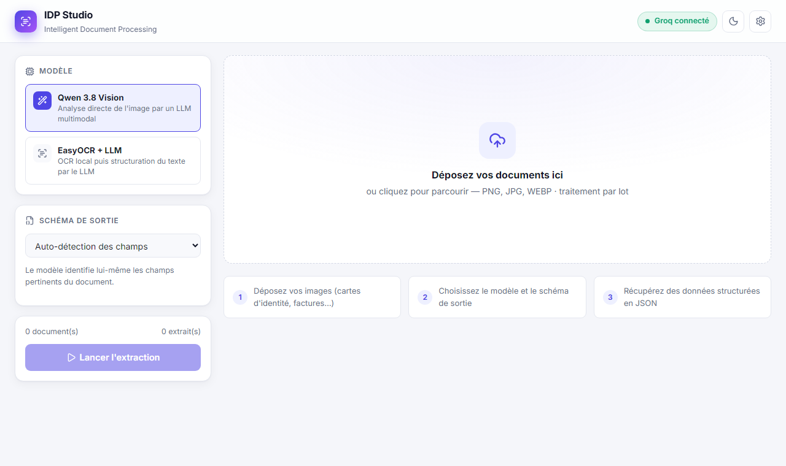
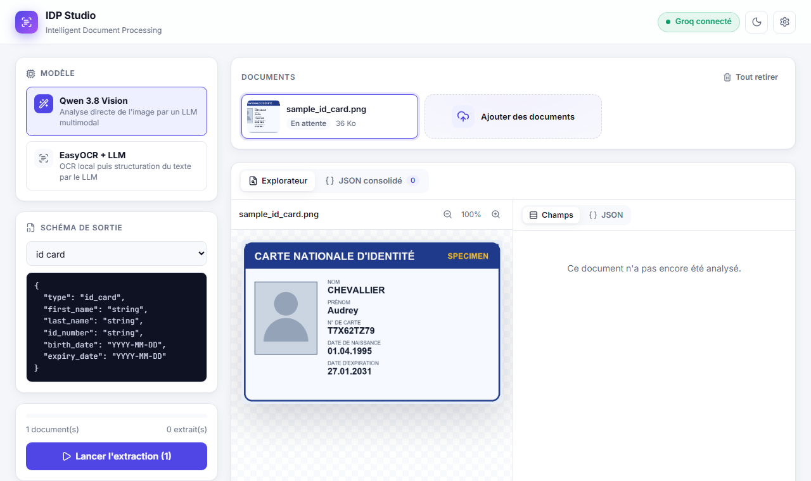
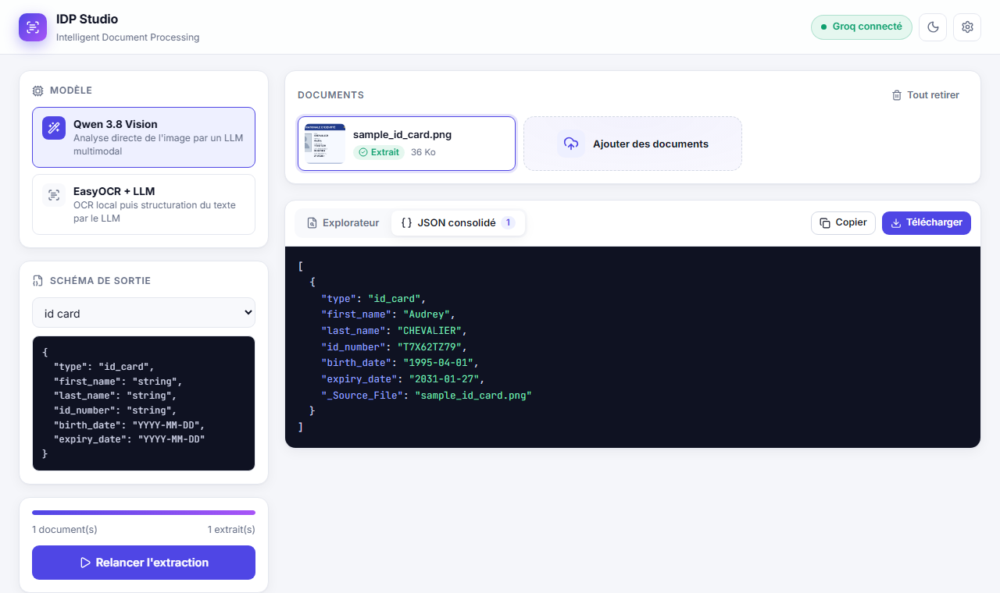

# IDP GenAI Project: Intelligent Document Processing

This project is an **Intelligent Document Processing (IDP)** solution designed to extract structured data from various documents (such as ID cards and invoices) using Multimodal Large Language Models (LLMs) and OCR technology.

## 🚀 Key Features

* **Multimodal Extraction**: Uses advanced vision models like `llama-4-scout` via the Groq API to analyze images directly.
* **Hybrid OCR + LLM Approach**: Supports extraction through **EasyOCR**, combined with an LLM to structure and correct raw text.
* **Schema-Based Validation**: Ensures data extraction follows predefined JSON format (prefefined json format is not mandatory), such as `id_card_schema.json` or `invoice_schema.json`.
* **React Web Interface**: Modern UI (light/dark themes) for batch uploading, document previewing, side-by-side inspection and JSON export, backed by a FastAPI server.
* **API Keys from the UI**: Enter, test, replace or delete your Groq API key directly from the interface (stored server-side, never displayed in clear).
* **Batch Processing**: Capable of processing multiple files simultaneously and consolidating the results into a single output.

## 🛠️ Project Architecture

```text
├── frontend/             # React + Vite + TypeScript web interface
├── backend/
│   ├── main.py           # FastAPI server (REST API + serves the built frontend)
│   └── settings_store.py # API keys entered from the UI (persisted, masked)
├── src/
│   ├── pipeline.py       # Extraction orchestration (vision LLM or OCR + LLM)
│   ├── llm_engine.py     # Logic for interacting with Groq Vision LLMs
│   ├── ocr_engine.py     # EasyOCR integration and LLM parsing logic
│   └── utils.py          # Helper functions for cleaning JSON outputs
├── schemas/              # JSON schemas defining the target data structure
├── tests/                # Backend API tests (pytest)
├── Dockerfile            # Multi-stage image (frontend build + Python runtime)
├── docker-compose.yml
├── app.py                # Legacy Streamlit interface
└── requirements.txt      # Python dependencies
```

## 🐳 Quick start with Docker (recommended)

```bash
docker compose up --build
```

Then open <http://localhost:8000> and click **Paramètres** (⚙️) to enter your Groq API key.

* The key is stored in the `idp-data` Docker volume and survives restarts.
* You can also pass it through the environment: `GROQ_API_KEY=gsk_... docker compose up` (a key entered in the UI takes precedence).
* To enable the **EasyOCR + LLM** mode (adds PyTorch, much larger image):
  `INSTALL_EASYOCR=true docker compose up --build`
* Change the port with `PORT=9000 docker compose up`.

## 💻 Local development

**Backend** (Python 3.11+):
```bash
pip install -r backend/requirements.txt   # add `easyocr` for the OCR mode
uvicorn backend.main:app --reload --port 8000
```

**Frontend** (Node 20+), in another terminal:
```bash
cd frontend
npm install
npm run dev        # http://localhost:5173, /api is proxied to :8000
```

`npm run build` produces `frontend/dist`, which the backend serves automatically on <http://localhost:8000>.

**Tests**:
```bash
pip install pytest httpx
pytest tests
```

## 🖥️ Usage

1. **API key**: open the settings (⚙️) and paste your Groq key (create one at [console.groq.com/keys](https://console.groq.com/keys)). Use **Tester** to check it.
2. **Model**: choose Llama 4 Vision or EasyOCR + LLM.
3. **Schema**: pick a predefined schema, write a custom one, or let the model auto-detect fields.
4. **Upload**: drag and drop your images (PNG, JPG, WEBP).
5. **Extract**: run the extraction, inspect each document side by side (fields or JSON view), then copy or download the consolidated JSON.

### REST API

| Method | Endpoint | Description |
| --- | --- | --- |
| `GET` | `/api/models` | Available extraction models |
| `GET` | `/api/schemas` | Predefined JSON schemas |
| `GET` | `/api/settings/keys` | API key status (masked) |
| `PUT` | `/api/settings/keys/GROQ_API_KEY` | Save a key `{"value": "..."}` |
| `DELETE` | `/api/settings/keys/GROQ_API_KEY` | Remove the key saved from the UI |
| `POST` | `/api/settings/keys/GROQ_API_KEY/test` | Check a key against Groq |
| `POST` | `/api/extract` | Multipart: `file`, `model`, optional `schema_json` |

Interactive docs are available at <http://localhost:8000/docs>.

## 📊 Demo & Results



*Full recording (WebM, ~0.5 MB): [docs/media/demo.webm](docs/media/demo.webm)*

### 1. Drop your documents

Drag & drop PNG / JPG / WEBP files (batch supported), pick the model (**Qwen Vision** or **EasyOCR + LLM**) and the output schema.



### 2. Choose a schema and run

Predefined schemas (`id_card`, `invoice`), a custom schema, or automatic field detection.



### 3. Inspect the result side by side

The original document on the left, the extracted fields on the right (table or raw JSON), with copy and export.


### 4. Export the consolidated JSON



The input is a (fictional) ID card ([sample](docs/media/sample_id_card.png)); the system transforms it into a structured JSON object:

```json
{
  "type": "id_card",
  "first_name": "Audrey",
  "last_name": "CHEVALLIER",
  "id_number": "T7X62TZ79",
  "birth_date": "1995-04-01",
  "expiry_date": "2031-01-27"
}
```

*(Real output of the Qwen Vision model with the `id_card` schema.)*
